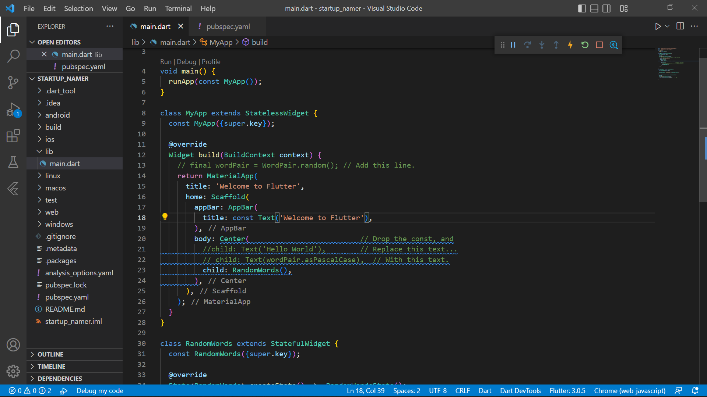

# **Tugas Pertemuan 20**
## **Project startup_namer**

### Praktikum 1 : Create the starter Flutter app

### Praktikum 2 : Use an external package
* tambahkan english_words package pada pubspec.yml

* import package baru pada main.dart

### Praktikum 3 : Add a stateful widget
* Tambah stateful widget RandomWords dengan membuat state class _RandomWordState

* Update the build() method in _RandomWordsState

* Remove the word-generation code from MyApp

### Praktikum 4 : Create an infinite scrolling ListView
* Add some state variables to the _RandomWordsState class.

* Update the build method for _RandomWordsState. Change it to use _buildSuggestions(), rather than directly calling the word-generation library.

* Update the build method for MyApp, changing the title in two places.

